# AlfaPOS — Qaytarish va qarz logikasi (to‘liq qo‘llanma)

**Maqsad:** Web (Vue) va Desktop ilovalar bir xil ishlashi uchun savatchadagi `-` bilan qaytarish, chek orqali qaytarish va qarzlarda qaytarish logikasining to‘liq tavsifi.

**Versiya:** 2026-05-22  
**Asosiy API:** `POST /store` → `SalesController::salesStore`

---

## Mundarija

1. [Umumiy ko‘rinish](#1-umumiy-korinish)
2. [Qaytarish rejimlari](#2-qaytarish-rejimlari)
3. [Savatchada `-` bilan ichki qaytarish](#3-savatchada--bilan-ichki-qaytarish)
4. [Chek orqali qaytarish](#4-chek-orqali-qaytarish)
5. [Ombor va `order_items.quantity`](#5-ombor-va-order_itemsquantity)
6. [Qarz modeli](#6-qarz-modeli)
7. [Qaytarishda qarz kamaytirish](#7-qaytarishda-qarz-kamaytirish)
8. [Asl chekni joyida tahrirlash (amend)](#8-asl-chekni-joyida-tahrirlash-amend)
9. [To‘lov turlari va cheklovlar](#9-tolov-turlari-va-cheklovlar)
10. [API shartnomasi (Desktop)](#10-api-shartnomasi-desktop)
11. [JSON namunalar](#11-json-namunalar)
12. [Kod manbalari](#12-kod-manbalari)

---

## 1. Umumiy ko‘rinish

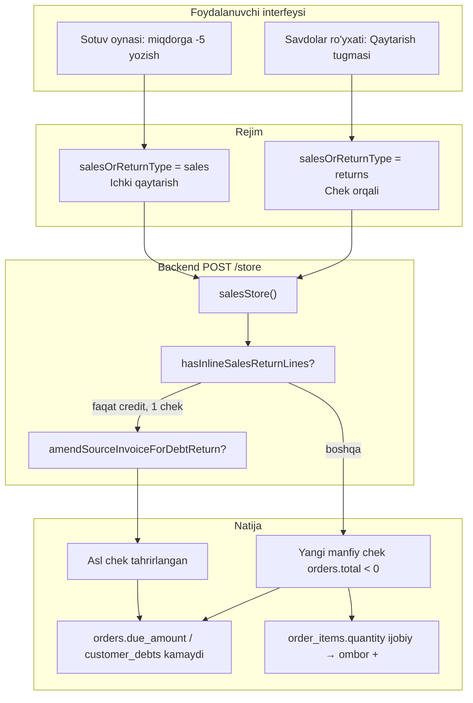

**Qisqa xulosa:**

| Harakat | Savat `quantity` | `orders.total` | Ombor (`order_items`) |
|---------|------------------|----------------|------------------------|
| Oddiy sotuv | `+5` | musbat | `-5` (kamayadi) |
| Ichki qaytarish (`-` savatda) | `-5` | manfiy | `+5` (ko‘payadi) |
| Chek orqali qaytarish | `-5` (server) | manfiy | `+5` (ko‘payadi) |

---

## 2. Qaytarish rejimlari

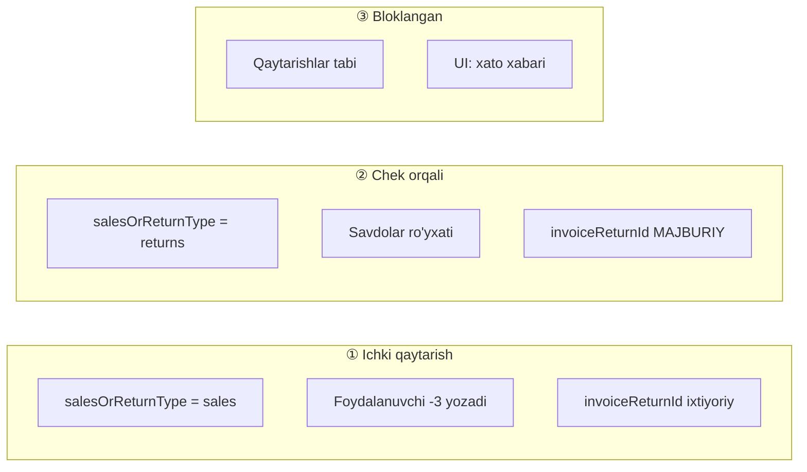

| Rejim | `salesOrReturnType` | Chek bog‘lanishi | UI manbasi |
|-------|----------------------|------------------|------------|
| **Ichki qaytarish** | `sales` | Ixtiyoriy | Sotuv → savat miqdori `-` |
| **Chek orqali** | `returns` | **Majburiy** | `/sales/list` → Qaytarish |
| **Mahsulot tabi** | `returns` | — | **Bloklangan** (`sales_return_status_returns_not_allowed`) |

**Sozlama:** `Setting::getSalesReturnMode()` → odatda `by_receipt` (chek asosida).

---

## 3. Savatchada `-` bilan ichki qaytarish

### 3.1 UI oqimi (rasm)

```
┌─────────────────────────────────────────────────────────────┐
│  SOTUV OYNASI                    salesOrReturnType = sales  │
├─────────────────────────────────────────────────────────────┤
│  Mijoz: [Ali Karimov ▼]                                     │
│  ┌──────────────────────────────────────────────────────┐   │
│  │ Mahsulot A    narx 50 000    miqdor: [  -3  ]  ▼   │   │
│  │ Mahsulot B    narx 20 000    miqdor: [   2  ]  ▼   │   │
│  └──────────────────────────────────────────────────────┘   │
│  Jami (grandTotal):  -110 000   ← manfiy qatorlar yig'indi  │
├─────────────────────────────────────────────────────────────┤
│  TO'LOV (effectiveReturnPaymentCondition = true)            │
│  Naqd:     paid = -110 000                                  │
│  Qarz:     [Chek tanlash] → invoiceReturnIds                │
│  Balans:   ❌ RUXSAT YO'Q (customer_balance)                │
└─────────────────────────────────────────────────────────────┘
```

### 3.2 Frontend qadamlar

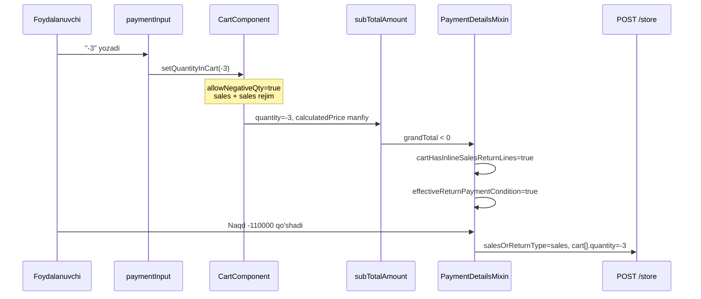

#### `allowNegativeQty` sharti

```javascript
// CartComponent.vue — setQuantityInCart
const allowNegativeQty =
  (salesOrReturnType === 'returns' && order_type === 'sales') ||
  (receiveOrReturnType === 'returns' && order_type === 'receiving') ||
  (order_type === 'sales' && salesOrReturnType === 'sales'); // ← ichki qaytarish
```

#### Jami hisob

```javascript
// salesComponentCommonMethod.js
const inlineSalesReturnLine =
  qtyForSub < 0 &&
  cartItem.orderType === 'sales' &&
  salesOrReturnType === 'sales';
```

#### Computed propertylar (`PaymentDetailsMixin.js`)

| Property | True bo‘lish sharti |
|----------|---------------------|
| `cartHasInlineSalesReturnLines` | `sales` rejimida `cart` da `quantity < 0` |
| `effectiveReturnPaymentCondition` | `returns` tab **yoki** (`grandTotal < 0` **va** inline qatorlar) |
| `showCustomerSalesReturnCreditButton` | Mijoz bor + (`returns` **yoki** inline + manfiy jami) |

### 3.3 Backend qadamlar (`salesStore`)

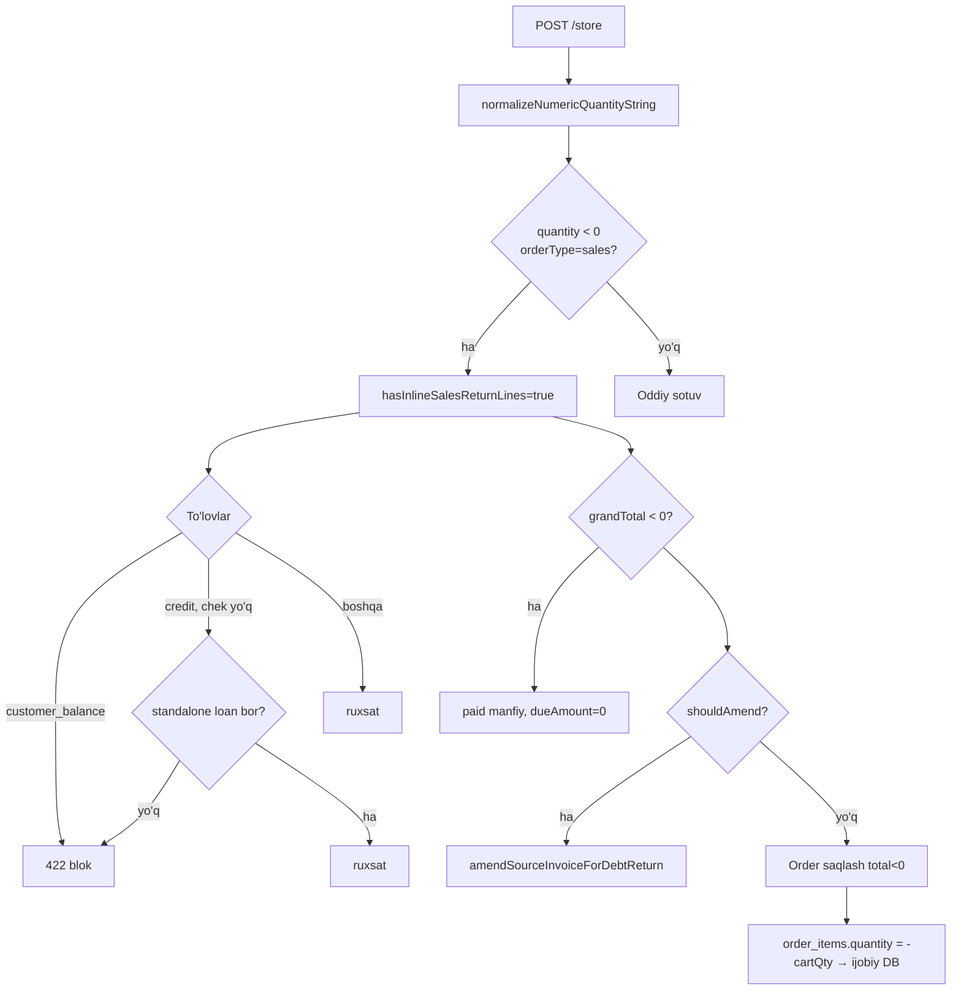

**Aniqlash (PHP):**

```php
$hasInlineSalesReturnLines = false;
if ($orderType === 'sales' && $salesOrReturnType !== 'returns') {
    foreach ($carts as $row) {
        if (($row['orderType'] ?? '') === 'sales' && floatval($row['quantity'] ?? 0) < 0) {
            $hasInlineSalesReturnLines = true;
            break;
        }
    }
}
```

**Miqdor normalizatsiya:**

```php
// "40 000", vergul, bosh minus
normalizeNumericQuantityString($raw): float
```

**Jami va to‘lovlar:**

```php
if ($hasInlineSalesReturnLines && $grandTotal < 0) {
    $grandTotal = -abs($grandTotal);
    // payment.paid > 0 → manfiy
    $dueAmount = 0.0;
}
```

**Ombor tekshiruvi:** faqat `cart['quantity'] > 0` — manfiy qatorlar tekshirilmaydi.

---

## 4. Chek orqali qaytarish

### 4.1 Oqim

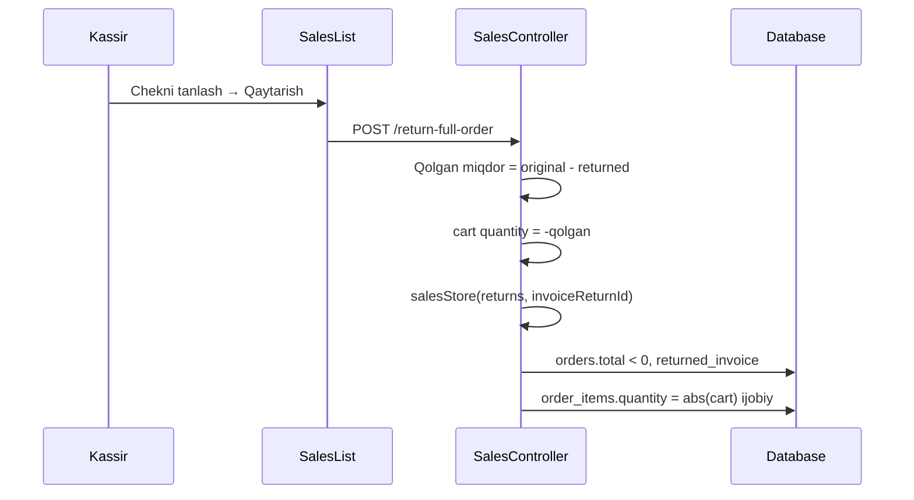

### 4.2 `getReturnProduct` — savatni yuklash

```
Original chek:     10 dona sotilgan
Avval qaytarilgan:  5 dona
Qolgan qaytarish:   5 dona  →  savatda quantity = -5

┌──────────────┬────────────┬──────────────┬─────────────────┐
│              │  Original  │  Qaytarilgan │  Savat (cart)   │
├──────────────┼────────────┼──────────────┼─────────────────┤
│  Variant A   │     10     │      5       │      -5         │
│  Variant B   │      3     │      3       │   (yashirin)    │
└──────────────┴────────────┴──────────────┴─────────────────┘
```

**API yo‘llari:**

| Method | URL | Vazifa |
|--------|-----|--------|
| POST | `/get-return-orders` | Chekni savatga yuklash |
| POST | `/return-full-order` | To‘liq qaytarish |
| POST | `/partial-return` | Qisman qaytarish |
| POST | `/get-order-items-for-return` | Qatorlar ro‘yxati |

**Majburiy:** `salesOrReturnType === 'returns'` va `invoiceReturnId` bo‘lmasa → **422**.

---

## 5. Ombor va `order_items.quantity`

### 5.1 Konventsiya diagrammasi

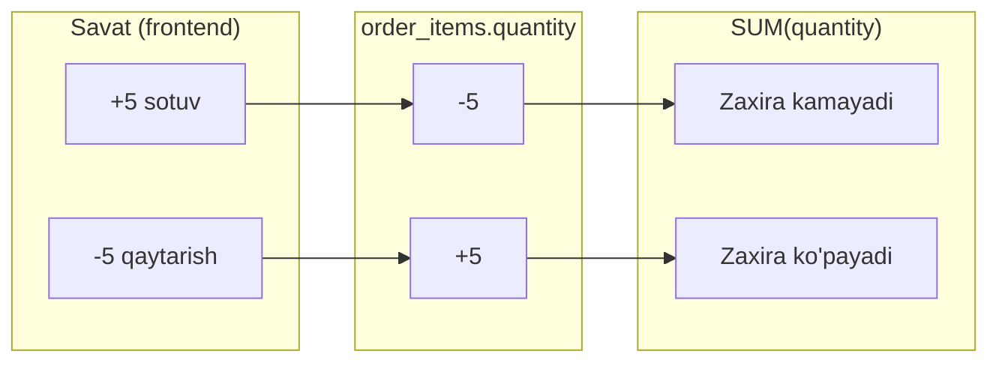

### 5.2 Saqlash formulasi

| `salesOrReturnType` | Savat `qty` | `actualQuantity` (pachka×) | DB `order_items.quantity` |
|---------------------|-------------|----------------------------|---------------------------|
| `sales` (oddiy) | `+5` | 5 | `-5` |
| `sales` (inline `-`) | `-5` | 5 | `-(-5)` = **`+5`** |
| `returns` | `-5` | 5 | **`abs(5)` = `+5`** |

```php
// salesStore — done holat
if ($salesOrReturnType == 'returns') {
    $quantity = abs($actualQuantity);  // omborga qo'shish
} else {
    $orderType == 'sales' ? $quantity = -$actualQuantity : $quantity = $actualQuantity;
}
```

### 5.3 Ombor SQL

```php
// OrderItems::sqlQuantityForBranchStock()
// SUM(order_items.quantity) — sotuv manfiy, qaytarish ijobiy
```

---

## 6. Qarz modeli

### 6.1 Ikki qatlam

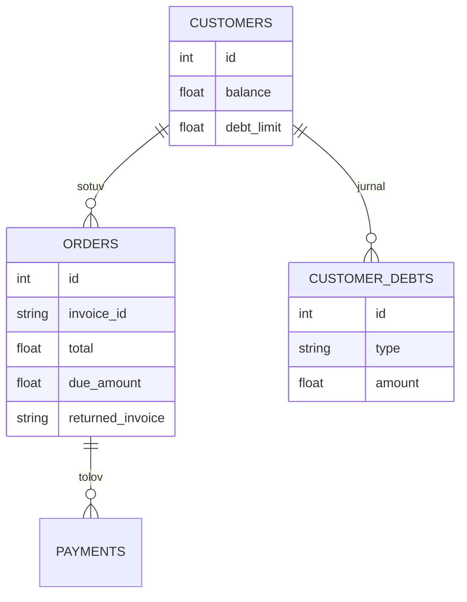

### 6.2 Jami qarz formulasi

```
┌─────────────────────────────────────────────────────────────┐
│  JAMI QARZ (mijoz)                                          │
│                                                             │
│   = SUM(orders.due_amount)     ← chekdagi ochiq qarz       │
│   + SUM(customer_debts WHERE type='loan')                   │
│   - SUM(customer_debts WHERE type='payment')                │
│                                                             │
│  customers.balance — alohida (oldindan to'lov, qarz emas)   │
└─────────────────────────────────────────────────────────────┘
```

| Qatlam | Jadval / maydon | Ma’nosi |
|--------|-----------------|---------|
| Chek qarzi | `orders.due_amount` | `credit` to‘lov qoldig‘i |
| Jurnal qarz | `customer_debts.type = loan` | Qo‘lda qarz, xarajat |
| Jurnal to‘lov | `customer_debts.type = payment` | Qarz yopish |
| Balans | `customers.balance` | Qaytarishda `customer_balance` orqali qaytariladi |

### 6.3 Ochiq qarzlar API

**`GET /customer/{id}/due-orders`**

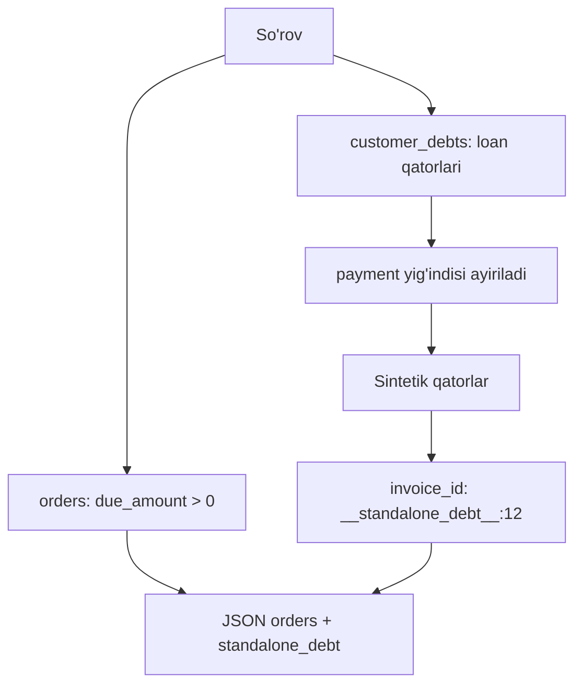

**Standalone kalitlar (frontend):**

```javascript
RETURN_CREDIT_STANDALONE_KEY = '__standalone_debt__'
RETURN_CREDIT_STANDALONE_PREFIX = '__standalone_debt__:'  // + loanId
```

---

## 7. Qaytarishda qarz kamaytirish

### 7.1 «Qarz» to‘lovi — pul emas, qarzni yopish

```
┌────────────────────────────────────────────────────────────┐
│  QAYTARISH: credit to'lovi                                 │
│                                                            │
│   paid = -100 000   ← MANFIY = "100 000 qarzni kamaytir"   │
│                                                            │
│   Yangi qaytarish chekida:  due_amount = 0                 │
│   Haqiqiy kamaytirish:      asl chek / customer_debts      │
└────────────────────────────────────────────────────────────┘
```

### 7.2 Frontend: chek tanlash

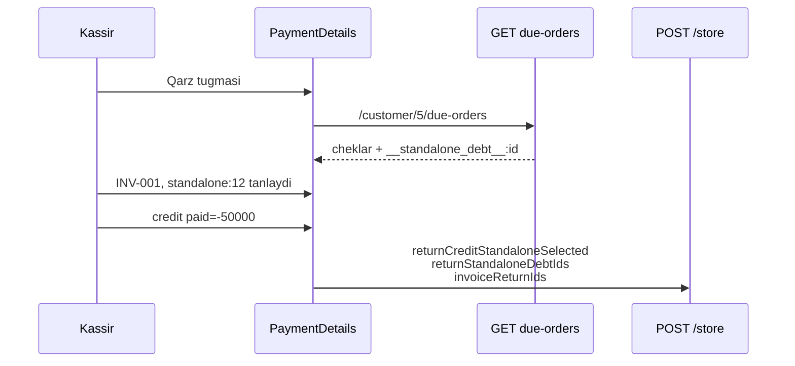

**MUHIM:** `returnCreditStandaloneSelected` va `returnStandaloneDebtIds` **request ildizida** ham yuboriladi (faqat `cart[0]` emas).

### 7.3 Backend: kredit cheklovi va FIFO

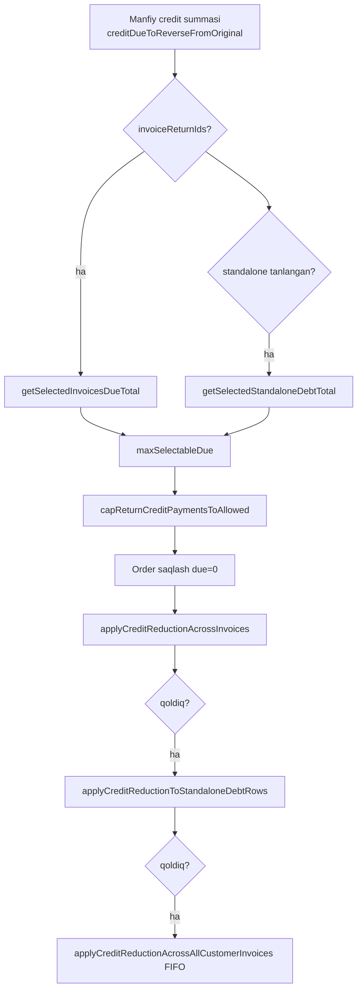

| Qadam | Funksiya | Ta'sir |
|-------|----------|--------|
| 1 | `applyCreditReductionAcrossInvoices` | Tanlangan `orders.due_amount` ↓ |
| 2 | `applyCreditReductionToStandaloneDebtRows` | Tanlangan `customer_debts` loan ↓ |
| 3 | `applyCreditReductionAcrossAllCustomerInvoices` | Qolgan barcha cheklar FIFO |

### 7.4 Ichki qaytarish + qarz jadvali

| To‘lov | Chek tanlangan | Standalone loan | Natija |
|--------|----------------|-----------------|--------|
| Naqd/karta | — | — | Pul qaytariladi |
| `customer_balance` | — | — | **422 blok** |
| `credit` | Ha | — | Chek `due_amount` ↓ |
| `credit` | Yo‘q | Bor | Jurnal loan ↓ |
| `credit` | Yo‘q | Yo‘q | **422 blok** |

---

## 8. Asl chekni joyida tahrirlash (amend)

Yangi qaytarish cheki **ochilmaydi** — asl chek yangilanadi.

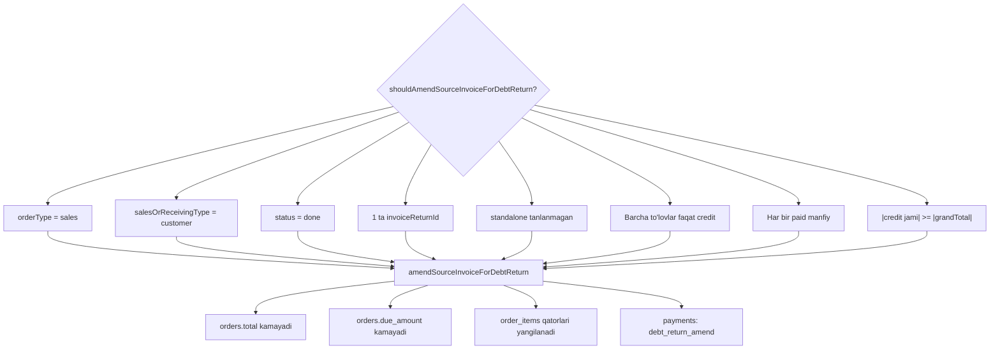

```
  MIJOZ RO'YXATI (amend dan oldin)          (amend dan keyin)
  ┌────────────────────────────┐          ┌────────────────────────────┐
  │ INV-001  Jami 500 000      │          │ INV-001  Jami 400 000      │
  │          Qarz  200 000     │   →      │          Qarz  100 000     │
  └────────────────────────────┘          └────────────────────────────┘
         + alohida qaytarish cheki YO'Q
```

---

## 9. To‘lov turlari va cheklovlar

### 9.1 Umumiy jadval

| To‘lov turi | Ichki qaytarish | Chek qaytarish | Izoh |
|-------------|-----------------|----------------|------|
| Naqd, karta, ... | `paid` manfiy | `paid` manfiy | Pul qaytarish |
| `credit` | Chek/standalone kerak | Modal + tanlov | Qarz kamayadi |
| `customer_balance` | **Blok** | Chek bog‘langan bo‘lsa | Balansga qaytarish |

### 9.2 Bugungi kassa limiti

Sozlama: `sales_return_require_today_payment_balance = 1`

```
  Smena ochilgan vaqtdan bugungi to'lov turlari balansi
  ─────────────────────────────────────────────────────
  Naqd:   1 000 000   →  maksimum naqd qaytarish shu miqdor
  Plastik:  500 000
  Qarz / Balans: cheklov yo'q (kassa emas)
```

### 9.3 Qaytarishni aniqlash (hisobot)

```sql
-- OrderItems::sqlOrderIsSalesReturnForAnalytics
orders.returned_invoice IS NOT NULL
OR orders.total < 0
```

---

## 10. API shartnomasi (Desktop)

### 10.1 Endpointlar

| Method | URL | Vazifa |
|--------|-----|--------|
| POST | `/store` | Sotuv, ichki qaytarish, chek qaytarish |
| POST | `/return-full-order` | To‘liq qaytarish |
| POST | `/partial-return` | Qisman qaytarish |
| POST | `/get-return-orders` | Chek savatini yuklash |
| GET | `/customer/{id}/due-orders` | Qarz/chek tanlash ro‘yxati |

### 10.2 Ichki qaytarish — majburiy maydonlar

| Maydon | Qiymat |
|--------|--------|
| `orderType` | `"sales"` |
| `salesOrReturnType` | `"sales"` (**emas** `"returns"`) |
| `status` | `"done"` |
| `cart[].orderType` | `"sales"` |
| `cart[].quantity` | **manfiy** (masalan `-3`) |
| `grandTotal` | **manfiy** |
| `payments[].paid` | **manfiy** |
| `dueAmount` | `0` |

### 10.3 Qarz qaytarish — qo‘shimcha maydonlar (ildizda!)

| Maydon | Turi | Ma’nosi |
|--------|------|---------|
| `returnCreditStandaloneSelected` | bool | `__standalone_debt__` tanlangan |
| `returnStandaloneDebtIds` | int[] | `customer_debts.id` ro‘yxati |
| `cart[0].invoiceReturnId` | string | Birinchi/asosiy chek |
| `cart[0].invoiceReturnIds` | string[] | Barcha tanlangan cheklar |

### 10.4 Desktop checklist

```
[ ] Miqdor maydonida minus (-) qabul qilinadi (sales rejimida)
[ ] Manfiy qator → grandTotal manfiy
[ ] effectiveReturnPaymentCondition: to'lovlar manfiy, balance ≈ 0
[ ] customer_balance qaytarishda ko'rsatilmaydi / 422
[ ] credit uchun avval GET due-orders + modal
[ ] returnCreditStandaloneSelected / returnStandaloneDebtIds ROOT da
[ ] Savat -N → server order_items +N (ombor ortadi)
[ ] salesOrReturnType=returns faqat chek orqali; invoiceReturnId majburiy
```

### 10.5 Qaror daraxti (Desktop algoritm)

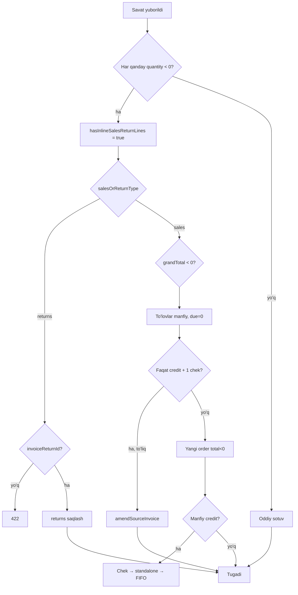

---

## 11. JSON namunalar

### 11.1 Ichki qaytarish — faqat naqd

```json
{
  "orderType": "sales",
  "salesOrReturnType": "sales",
  "salesOrReceivingType": "customer",
  "status": "done",
  "customer": { "id": 5 },
  "grandTotal": -150000,
  "subTotal": -150000,
  "tax": 0,
  "discount": 0,
  "dueAmount": 0,
  "cart": [
    {
      "productID": 10,
      "variantID": 22,
      "orderType": "sales",
      "quantity": -3,
      "price": 50000,
      "calculatedPrice": -150000,
      "taxID": null
    }
  ],
  "payments": [
    {
      "paymentType": "cash",
      "paymentID": 1,
      "paid": "-150000.00",
      "paymentName": "Naqd"
    }
  ],
  "time": "2026-05-22 14:30:00"
}
```

### 11.2 Ichki qaytarish — qarzni kamaytirish (chek tanlangan)

```json
{
  "orderType": "sales",
  "salesOrReturnType": "sales",
  "status": "done",
  "customer": { "id": 5 },
  "grandTotal": -200000,
  "dueAmount": 0,
  "returnCreditStandaloneSelected": false,
  "returnStandaloneDebtIds": [],
  "cart": [
    {
      "productID": 10,
      "variantID": 22,
      "orderType": "sales",
      "quantity": -4,
      "price": 50000,
      "calculatedPrice": -200000,
      "invoiceReturnId": "INV-2026-00142",
      "invoiceReturnIds": ["INV-2026-00142"]
    }
  ],
  "payments": [
    {
      "paymentType": "credit",
      "paymentID": 2,
      "paid": "-200000.00",
      "paymentName": "Qarz"
    }
  ]
}
```

### 11.3 Ichki qaytarish — jurnal qarz (standalone)

```json
{
  "returnCreditStandaloneSelected": true,
  "returnStandaloneDebtIds": [12, 15],
  "cart": [
    {
      "quantity": -2,
      "orderType": "sales",
      "invoiceReturnIds": ["__standalone_debt__:12"]
    }
  ],
  "payments": [
    { "paymentType": "credit", "paid": "-50000.00" }
  ]
}
```

### 11.4 Chek orqali to‘liq qaytarish (server yuboradi)

```json
{
  "orderType": "sales",
  "salesOrReturnType": "returns",
  "status": "done",
  "grandTotal": -500000,
  "cart": [
    {
      "quantity": -10,
      "invoiceReturnId": "INV-2026-00142",
      "orderType": "sales"
    }
  ],
  "payments": [
    { "paymentType": "cash", "paid": "-300000.00" },
    { "paymentType": "credit", "paid": "-200000.00" }
  ]
}
```

### 11.5 `GET /customer/5/due-orders` — javob namunasi

```json
{
  "orders": [
    {
      "id": 101,
      "invoice_id": "INV-2026-00142",
      "date": "2026-05-20 10:00:00",
      "due_amount": 200000,
      "total": 500000
    },
    {
      "id": "standalone-debt-12",
      "invoice_id": "__standalone_debt__:12",
      "due_amount": 80000,
      "is_standalone_debt": true,
      "standalone_debt_id": 12
    }
  ],
  "standalone_debt": 80000
}
```

### 11.6 Xato javoblari (422)

| Holat | Xabar kaliti |
|-------|----------------|
| `customer_balance` ichki qaytarishda | `sales_inline_return_payment_not_allowed` |
| `credit` chek/standalone yo‘q | `sales_inline_return_payment_not_allowed` |
| `returns` cheksiz | `sales_return_blocked_product_mode_expected_receipt` |
| Kassa balansi yetarli emas | `sales_return_insufficient_payment_type_balance` |
| Qarz tanlanmagan | `select_invoice_for_return_credit` |

---

## 12. Kod manbalari

### 12.1 Frontend (Vue)

| Fayl | Funksiya / qism |
|------|-----------------|
| `resources/assets/js/components/salesOrReceives/cart/CartComponent.vue` | `setQuantityInCart`, `formatCartRowQuantity` |
| `resources/assets/js/components/commonComponents/paymentInput.vue` | Miqdor input, minus |
| `resources/assets/js/components/salesOrReceives/helper/salesComponentCommonMethod.js` | `subTotalAmount`, `inlineSalesReturnLine` |
| `resources/assets/js/components/salesOrReceives/mixin/PaymentDetailsMixin.js` | `cartHasInlineSalesReturnLines`, `effectiveReturnPaymentCondition`, qarz modal |
| `resources/assets/js/components/salesOrReceives/mixin/SalesOrPurchaseMixin.js` | Savat, `selectOrder`, sales list |
| `resources/assets/js/components/salesOrReceives/salesList/SalesList.vue` | `returnOrder` → `/return-full-order` |
| `public/js/app.js` | Kompilyatsiya qilingan bundle |

### 12.2 Backend (PHP)

| Fayl | Funksiya / qism |
|------|-----------------|
| `app/Http/Controllers/API/SalesController.php` | `salesStore`, `getReturnProduct`, `returnFullOrder`, `amendSourceInvoiceForDebtReturn`, `applyCreditReduction*` |
| `app/Http/Controllers/API/CustomerController.php` | `getCustomerDueOrders`, `bulkDuePayment` |
| `app/Models/Order.php` | `getReturnProduct`, delete restore |
| `app/Models/OrderItems.php` | `sqlQuantityForBranchStock`, analitika |
| `app/Models/Setting.php` | `getSalesReturnMode` |
| `routes/sales_purchase/sales_purchase.php` | API route'lar |

### 12.3 Ma’lumotlar bazasi

| Jadval | Qaytarishdagi rol |
|--------|-------------------|
| `orders` | `total`, `due_amount`, `returned_invoice`, `return_type` |
| `order_items` | `quantity` (+ qaytarish, − sotuv) |
| `payments` | `paid` manfiy, `debt_return_amend` |
| `customer_debts` | `loan` / `payment` |
| `customers` | `balance`, `debt_limit` |
| `customer_balance_transactions` | Balans qaytarish |

---

## Tezkor eslatma (1 sahifa)

```
┌──────────────────────────────────────────────────────────────────┐
│  MINUS SAVATDA = ichki qaytarish                                 │
│    salesOrReturnType: "sales" (returns emas!)                    │
│    quantity < 0  →  grandTotal < 0  →  paid manfiy             │
│                                                                  │
│  OMBOR: savat -N  →  DB order_items +N  →  zaxira ortadi         │
│                                                                  │
│  QARZ: qaytarish chekida due=0; kamaytirish asl chek/jurnalda    │
│    credit paid manfiy; GET /customer/{id}/due-orders             │
│    customer_balance ichki qaytarishda TAQLANADI                    │
│                                                                  │
│  CHEK ORQALI: salesOrReturnType "returns" + invoiceReturnId      │
│    POST /return-full-order yoki Sales List                       │
└──────────────────────────────────────────────────────────────────┘
```

---

*Hujjat AlfaPOS web kod bazasiga asoslangan. Desktop integratsiyasi uchun shu fayldagi API maydonlari va diagrammalar etalon hisoblanadi.*
